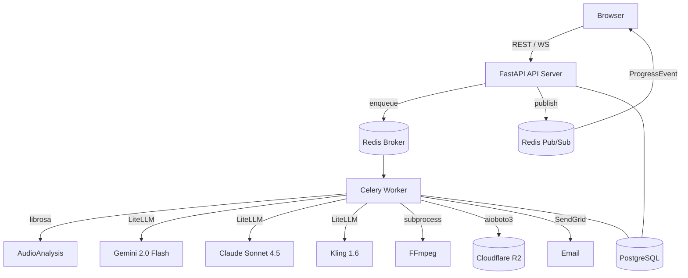

# Design Document — VIGEN Phase 1 MVP

## Overview

VIGEN is a music-driven AI video generation SaaS. A user uploads an audio track, the platform analyses it with librosa + Gemini, generates a beat-aligned storyboard with Claude, presents an approval gate, renders scenes in parallel with Kling, assembles the final MP4 with FFmpeg, and notifies the user via SendGrid.

The existing codebase is a well-structured Sprint-1 scaffold. Every AI/ML integration and media-processing step is either a stub or incomplete. This design covers what must be built, corrected, or wired to deliver a production-ready Phase 1 MVP.

### Key Design Goals

- All long-running work runs in Celery workers — the API thread never blocks on AI calls.
- Every external provider call has a deterministic fallback so a single API failure never kills a job.
- The approval gate is a hard gate — no GPU spend before the user clicks "Approve".
- Per-job cost caps are enforced after every scene completes.
- The storage layer is backend-agnostic (R2 or filesystem) behind a single `StorageService` interface.
- Schema changes go through Alembic only — `create_all` is removed from the lifespan.

---

## Architecture



### Request / Worker Boundary

| Concern | API Thread | Celery Worker |
|---|---|---|
| Job creation, approval, rejection | ✅ | — |
| Audio analysis (librosa + Gemini) | — | ✅ |
| Storyboard generation (Claude) | — | ✅ |
| Scene rendering (Kling) | — | ✅ |
| FFmpeg assembly | — | ✅ |
| WebSocket fan-out | ✅ | publishes events |

---

## Components and Interfaces

### 1. `AudioAnalysisProvider`

**File:** `backend/app/services/providers.py`

**Current issues:**
- Gemini call is text-only; must be upgraded to multimodal (audio bytes or file URI).
- No deterministic fallback from librosa energy features — falls back to hardcoded strings.

**Target interface (unchanged):**
```python
async def analyze(self, audio_url: str, duration_seconds: float) -> dict
```

**Target behaviour:**
1. Load audio at 22 050 Hz via `librosa.load`.
2. Extract BPM, beat frames, onset frames, RMS energy arc.
3. Call Gemini 2.0 Flash with the audio file content (multimodal) for mood/genre/key/summary.
4. On Gemini failure: derive mood from RMS energy (high → "energetic", low → "ambient"), genre from spectral centroid, key from chroma features.
5. Return the full analysis dict including `scene_count_hint`.

### 2. `StoryboardProvider`

**File:** `backend/app/services/providers.py`

**Current issues:**
- Model string is `anthropic/claude-3-5-sonnet` — must be `anthropic/claude-sonnet-4-5`.
- No retry loop (up to 2 retries on invalid JSON / schema failure).
- No injection of `style_preset` modifiers.
- No injection of `storyboard_rejection_reason` on regeneration.
- No `prompt_template_version` capture.

**Target interface (unchanged):**
```python
async def generate(self, analysis: dict, duration_seconds: float, preset: StylePreset | None, rejection_reason: str | None) -> StoryboardSchema
```

**Retry logic:**
```
attempt 1 → Claude call → validate StoryboardSchema
attempt 2 → Claude call (on JSON/schema error) → validate
attempt 3 → Claude call (on JSON/schema error) → validate
fallback  → deterministic scene generator
```

### 3. `VideoRenderProvider`

**File:** `backend/app/services/providers.py`

**Current issues:**
- LiteLLM does not natively support Kling video generation — must use direct HTTP to the Kling API.
- Response parsing is unverified.
- No cost tracking per scene.

**Target interface (unchanged):**
```python
async def render_scene(self, job_id: str, scene_index: int, prompt: str, duration_seconds: float) -> RenderResult
```

**Kling API flow:**
1. `POST https://api.kling.ai/v1/videos/text2video` with `prompt`, `duration`, `aspect_ratio`.
2. Poll `GET /v1/videos/text2video/{task_id}` until `status == "succeed"` or timeout (120 s).
3. Extract `video_url` from response, download, upload to storage, return `RenderResult`.

### 4. `VideoAssemblyProvider`

**File:** `backend/app/services/providers.py`

**Current issues:**
- `subprocess.run` is blocking — must use `asyncio.create_subprocess_exec`.
- No duration validation after assembly.
- Partial preview writes placeholder bytes instead of real FFmpeg output.

**Target interface (unchanged):**
```python
async def assemble(self, job_id: str, scene_urls: list[str], audio_url: str, expected_duration: float) -> str
```

### 5. `StorageService`

**File:** `backend/app/services/storage.py`

**Target interface:**
```python
async def write_bytes(self, path: str, data: bytes) -> str  # returns public URL
async def read_bytes(self, path: str) -> bytes
async def write_stream(self, path: str, stream: AsyncIterator[bytes]) -> str
```

R2 backend uses `aioboto3`; filesystem backend writes to `filesystem_storage_root` and returns `/media/{path}`.

### 6. `CreditService`

**File:** `backend/app/services/credits.py` *(new)*

```python
async def deduct_credits(self, session, user_id, job_id, amount_usd) -> CreditTransaction
async def reconcile_credits(self, session, user_id, job_id, actual_usd) -> CreditTransaction
async def get_balance(self, session, user_id) -> Decimal
```

### 7. `NotificationService`

**File:** `backend/app/services/notifications.py`

**Current issues:** SendGrid call is a log-only stub.

**Target behaviour:**
- If `sendgrid_api_key` is set: send via `sendgrid.SendGridAPIClient`.
- If not set: log at INFO level, return without error.
- Never raise — email failure must not fail the job.

### 8. `JobService`

**File:** `backend/app/services/jobs.py`

**Changes required:**
- `render_job`: replace sequential loop with Celery `group` of `render_scene` sub-tasks.
- `render_job`: enforce `cost_cap_usd` after each scene completes.
- `render_job`: trigger real partial preview assembly (not placeholder bytes) at `preview_scene_threshold`.
- `run_analysis_and_planning`: pass `style_preset` and `rejection_reason` to `StoryboardProvider`.
- `approve_storyboard`: call `CreditService.deduct_credits` before enqueuing render.
- `render_job` (on complete): call `CreditService.reconcile_credits`.

### 9. Celery Tasks

**File:** `backend/app/workers/tasks.py`

**New tasks:**
```python
@celery_app.task(name="jobs.render_scene")
def render_scene(job_id: str, scene_index: int) -> None: ...
```

**Chord pattern for parallel rendering:**
```python
from celery import group, chord

scene_tasks = group(render_scene.s(job_id, s.scene_index) for s in pending_scenes)
chord(scene_tasks)(assemble_job.s(job_id))
```

### 10. Frontend — Create Job Page

**File:** `frontend/app/create/page.jsx`

Components:
- `AudioDropzone` — drag-and-drop, validates MIME type and size (≤ 200 MB), shows upload progress bar.
- `PresetSelector` — fetches `GET /api/presets`, renders preset cards.
- `CreateJobButton` — disabled until upload complete and preset selected; calls `POST /api/jobs`.

### 11. Frontend — Bug Fixes

| File | Issue | Fix |
|---|---|---|
| `client-shell.jsx` | imports `ui.jsxx` | change to `ui.jsx` |
| All pages | unused `React` imports | remove where no JSX |
| `create/page.jsx` | empty page | implement upload form |

---

## Data Models

All models already exist in `backend/app/models/`. No new tables are required for Phase 1. The following fields need to be confirmed present (they are):

### `jobs` table (key fields)
| Field | Type | Notes |
|---|---|---|
| `status` | `String(50)` | 10-state machine |
| `cost_cap_usd` | `Numeric(10,4)` | enforced per scene |
| `actual_cost_usd` | `Numeric(10,4)` | accumulated from scenes |
| `estimated_cost_usd` | `Numeric(10,4)` | set at planning time |
| `storyboard_approved` | `Boolean` | gate flag |
| `storyboard_rejection_reason` | `Text` | fed back to Claude |
| `prompt_template_version` | `String(50)` | captured at generation |
| `preview_video_url` | `Text` | set after N scenes |
| `final_video_url` | `Text` | set after assembly |

### `scenes` table (key fields)
| Field | Type | Notes |
|---|---|---|
| `status` | `String(50)` | pending/rendering/complete/failed |
| `video_url` | `Text` | set after render |
| `cost_usd` | `Numeric(10,4)` | per-scene cost |
| `render_time_seconds` | `Float` | latency tracking |
| `failure_reason` | `Text` | "cost_cap_exceeded" etc. |

### `credit_transactions` table
| Field | Type | Notes |
|---|---|---|
| `id` | UUID PK | |
| `user_id` | FK → users | |
| `job_id` | FK → jobs | |
| `amount` | `Numeric(10,4)` | negative = deduction |
| `type` | `String(50)` | "reserve" / "reconcile" |
| `created_at` | `DateTime` | |

> A new Alembic migration must be created for `credit_transactions`.

### `StoryboardSchema` (Pydantic)

Already defined in `backend/app/schemas/storyboard.py`. Validators enforce:
- `end_time_seconds > start_time_seconds`
- `duration_seconds ≈ end - start` (within 0.1 s)
- Contiguous scenes (gap ≤ 0.1 s between consecutive scenes)
- `total_duration_seconds` matches final scene end (within 0.1 s)

---

---

## Correctness Properties

*A property is a characteristic or behavior that should hold true across all valid executions of a system — essentially, a formal statement about what the system should do. Properties serve as the bridge between human-readable specifications and machine-verifiable correctness guarantees.*

---

**Property 1: Job creation returns queued status**
*For any* valid job creation payload, the API response must have `status="queued"` and the Celery broker must have received exactly one `jobs.analyse_and_plan` task for that job ID.
**Validates: Requirements 1.1**

---

**Property 2: Task failure sets job to failed**
*For any* job where the Celery task raises an unhandled exception, the job record in the database must have `status="failed"` and a non-empty `failure_reason` string.
**Validates: Requirements 1.4**

---

**Property 3: Analysis result structure**
*For any* audio file processed by `AudioAnalysisProvider.analyze`, the returned dict must contain all eight keys: `bpm`, `beats`, `onsets`, `mood`, `genre`, `key`, `energy_arc`, and `scene_count_hint`, with `bpm > 0`, `beats` a non-empty list, and `mood`/`genre`/`key` non-empty strings — regardless of whether the Gemini call succeeds or falls back.
**Validates: Requirements 2.1, 2.2, 2.3, 2.5**

---

**Property 4: Analysis persistence round-trip**
*For any* audio file, after `run_analysis_and_planning` completes, the `audio_beat_maps` row for that job must have `bpm`, `beat_times`, and `onset_times` equal to the values returned by `AudioAnalysisProvider.analyze`, and `job.audio_analysis` must contain all eight required keys.
**Validates: Requirements 2.4, 2.5**

---

**Property 5: StoryboardSchema validation invariant**
*For any* dict produced by `StoryboardProvider.generate`, constructing `StoryboardSchema(**data)` must succeed without raising a `ValidationError`, meaning scenes are contiguous (gap ≤ 0.1 s), `total_duration_seconds` matches the final scene end time within 0.1 s, and each scene's `duration_seconds ≈ end - start`.
**Validates: Requirements 3.2**

---

**Property 6: Storyboard generation persistence**
*For any* audio analysis result, after `run_analysis_and_planning` completes, `job.status` must be `"awaiting_approval"` and the number of `Scene` rows in the database for that job must equal `len(storyboard.scenes)`.
**Validates: Requirements 3.4**

---

**Property 7: Claude prompt construction**
*For any* audio analysis dict and style preset, the prompt string passed to the LiteLLM `completion` call must contain the `bpm`, `mood`, `genre`, `energy_arc` values from the analysis and the preset's `prompt_modifier`, `motion_bias`, and `lighting_bias` values. When a `rejection_reason` is provided, the prompt must also contain that string.
**Validates: Requirements 3.1, 3.5, 12.3**

---

**Property 8: Approval gate — no render before approve**
*For any* job in `status="awaiting_approval"`, the Celery broker must have zero `jobs.render` tasks enqueued for that job ID until `approve_storyboard` is explicitly called.
**Validates: Requirements 4.1**

---

**Property 9: Approval state transition**
*For any* job in `status="awaiting_approval"`, after `approve_storyboard` is called, the job must have `storyboard_approved=True`, a non-null `storyboard_approved_at`, and `status="rendering"`.
**Validates: Requirements 4.2**

---

**Property 10: Rejection state mutation**
*For any* job in `status="awaiting_approval"`, after `reject_storyboard(reason)` is called, `storyboard_regeneration_count` must increase by exactly 1 and `storyboard_rejection_reason` must equal the provided reason string.
**Validates: Requirements 4.3**

---

**Property 11: Scene render persistence**
*For any* scene that completes rendering successfully, the `Scene` row in the database must have `status="complete"`, a non-null `video_url`, a positive `cost_usd`, and a positive `render_time_seconds`.
**Validates: Requirements 5.2, 5.3**

---

**Property 12: Preview threshold trigger**
*For any* job where `scenes_completed` reaches `preview_scene_threshold`, `job.preview_video_url` must become non-null after that scene's completion is processed.
**Validates: Requirements 5.5**

---

**Property 13: Cost cap enforcement**
*For any* job where `actual_cost_usd` exceeds `cost_cap_usd` after a scene completes, all remaining `Scene` rows with `status="pending"` must be set to `status="failed"` with `failure_reason="cost_cap_exceeded"`, and `job.status` must be `"failed"` with the same `failure_reason`.
**Validates: Requirements 5.6, 11.2, 11.3**

---

**Property 14: FFmpeg command construction**
*For any* set of scene URLs and audio URL, the FFmpeg command constructed by `VideoAssemblyProvider.assemble` must include `-f concat -safe 0`, the concat list must list scene files in ascending `scene_index` order, and the command must include `-map 1:a -c:a aac -shortest`.
**Validates: Requirements 6.1, 6.2**

---

**Property 15: Assembly duration validation**
*For any* assembled video, the duration reported by FFprobe must be within 0.5 seconds of `job.audio_duration_seconds`. If the duration check fails, `job.status` must be `"failed"` with a non-empty `failure_reason`.
**Validates: Requirements 6.3, 6.4**

---

**Property 16: Storage backend routing**
*For any* file write, when `storage_backend="r2"` the returned URL must start with `r2_public_base_url`; when `storage_backend="filesystem"` the file must exist at `filesystem_storage_root / path` and the returned URL must start with `/media/`.
**Validates: Requirements 7.1, 7.2, 7.3**

---

**Property 17: Audio upload validation**
*For any* file upload request, the endpoint must reject files with MIME types other than `audio/mpeg`, `audio/wav`, or `audio/flac`, and must reject files larger than 200 MB, returning a 4xx error in both cases.
**Validates: Requirements 7.4**

---

**Property 18: ProgressEvent structure**
*For any* pipeline stage transition, the `ProgressEvent` published to the broker must contain non-null `stage`, `percent` (0–100), `scenes_complete`, `scenes_total`, and `message` fields. The terminal event for a completed job must have `stage="done"` and `percent=100`.
**Validates: Requirements 8.2, 8.4**

---

**Property 19: Notification arguments**
*For any* job that reaches `status="complete"`, `NotificationService.send_job_complete_email` must be called with the job's `user.email`, `job.id`, and `job.final_video_url`. When `sendgrid_api_key` is absent, the call must complete without raising an exception.
**Validates: Requirements 9.1, 9.4**

---

**Property 20: Credit deduction persistence**
*For any* job approval where the user has sufficient credits, `CreditService.deduct_credits` must be called with the correct `estimated_cost_usd`, and a `credit_transactions` row must be inserted with `type="reserve"` and `amount` equal to the estimated cost.
**Validates: Requirements 10.1, 10.3**

---

**Property 21: Insufficient credits rejection**
*For any* user whose credit balance is less than `job.estimated_cost_usd`, calling `approve_storyboard` must return a `402 Payment Required` response and must not enqueue a render task.
**Validates: Requirements 10.4**

---

**Property 22: Credit balance accuracy**
*For any* sequence of deductions and reconciliations, `GET /api/credits/balance` must return the sum of all `credit_transactions.amount` values for that user.
**Validates: Requirements 10.5**

---

**Property 23: Cost cap default**
*For any* job created without an explicit `cost_cap_usd`, the stored `job.cost_cap_usd` must equal `settings.cost_cap_usd_default` (20.00). For any job created with an explicit value, the stored value must equal the provided value.
**Validates: Requirements 11.1**

---

**Property 24: Scene retry state mutation**
*For any* failed scene, after `retry_scene` is called, the scene must have `status="pending"` and `regeneration_count` must increase by exactly 1. If the job was previously `"complete"` or `"failed"`, `job.status` must become `"rendering"`.
**Validates: Requirements 15.1, 15.2**

---

**Property 25: Log entry structure**
*For any* pipeline stage execution, the emitted `structlog` log entry must contain `job_id`, `stage`, `provider`, `model`, `latency_ms`, and `cost_usd` fields with non-null values.
**Validates: Requirements 16.1**

---

**Property 26: Preset injection in job payload**
*For any* preset selected on the create job page, the `POST /api/jobs` request body must contain `style_preset_id` equal to the selected preset's ID.
**Validates: Requirements 12.2**

---

**Property 27: Dashboard job ordering**
*For any* authenticated user with N jobs, the dashboard API response must return jobs ordered by `created_at` descending (newest first).
**Validates: Requirements 14.1**

---

**Property 28: Dashboard conditional rendering**
*For any* job card rendered on the dashboard: if `status="awaiting_approval"` a "Review storyboard" link must be present; if `status="complete"` a download button linked to `final_video_url` must be present; if `status="failed"` the `failure_reason` text must be present.
**Validates: Requirements 14.2, 14.3, 14.4**

---

## Error Handling

### Provider Failures

| Provider | Failure Mode | Recovery |
|---|---|---|
| Gemini (audio intel) | API error / timeout | Deterministic fallback from librosa features |
| Claude (storyboard) | Invalid JSON / schema error | Retry up to 2×, then deterministic fallback |
| Kling (scene render) | API error / timeout | Set `scene.status="failed"`, continue other scenes |
| FFmpeg (assembly) | Non-zero exit code | Set `job.status="failed"`, log stderr |
| SendGrid (email) | API error | Log at ERROR, continue — never fail the job |
| R2 (storage write) | boto3 exception | Log + raise → Celery retry |

### State Machine Invariants

- A job can only transition forward through states: `queued → analysing → planning → awaiting_approval → rendering → assembling → complete` or to `failed` from any state.
- `approve_storyboard` is a no-op (raises `ValueError`) if `status != "awaiting_approval"`.
- `reject_storyboard` is a no-op if `status != "awaiting_approval"`.
- Cost cap check runs after every scene completion — not just at the end.

### HTTP Error Codes

| Condition | HTTP Status |
|---|---|
| Job not found | 404 |
| Wrong job state for action | 409 Conflict |
| Insufficient credits | 402 Payment Required |
| Invalid file type / size | 422 Unprocessable Entity |
| Unauthenticated | 401 |

---

## Testing Strategy

### Property-Based Testing Library

**Backend:** [`hypothesis`](https://hypothesis.readthedocs.io/) with `hypothesis-jsonschema` for JSON generation.
Each property-based test must run a minimum of **100 examples** (configured via `@settings(max_examples=100)`).

**Frontend:** [`fast-check`](https://fast-check.io/) for React component property tests.

### Annotation Convention

Every property-based test must be tagged with a comment in this exact format:
```
# Feature: vigen-phase1-mvp, Property {N}: {property_text}
```

### Unit Tests

Unit tests cover:
- Specific examples for each API endpoint (happy path + error cases)
- `StoryboardSchema` validation edge cases (gap > 0.1 s, duration mismatch, empty scenes)
- `StorageService` URL construction for both backends
- `CreditService` balance calculation with mixed deductions and reconciliations
- FFmpeg command argument construction

### Property-Based Tests

Each of the 28 correctness properties above maps to exactly one property-based test. Key generators:

- **Audio analysis:** Hypothesis generates synthetic `librosa`-compatible numpy arrays (sine waves at random frequencies and durations).
- **Storyboard:** Hypothesis generates valid `StoryboardSchema` dicts using `st.fixed_dictionaries` with constrained floats.
- **Job payloads:** Hypothesis generates `CreateJobRequest` instances with random durations, preset IDs, and cost caps.
- **Credit transactions:** Hypothesis generates sequences of deduction/reconciliation amounts and verifies balance invariants.
- **FFmpeg args:** Hypothesis generates lists of scene URLs and verifies command construction without executing FFmpeg.

### Integration Tests

- Full pipeline smoke test using `use_mock_pipeline=True` (existing mock mode).
- WebSocket progress event sequence test using `httpx` async client.
- Storage backend switching test (filesystem ↔ R2 mock).

### Frontend Tests

- Component tests with React Testing Library for `AudioDropzone`, `PresetSelector`, dashboard job cards.
- Property tests with `fast-check` for dashboard ordering and conditional rendering (Properties 27, 28).
